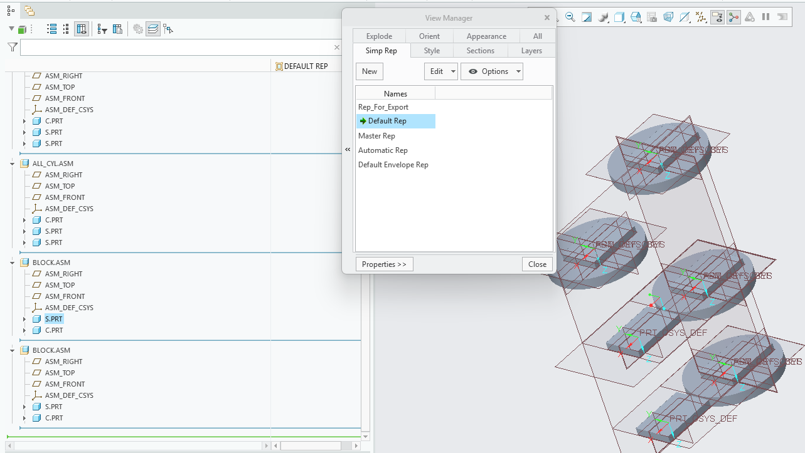
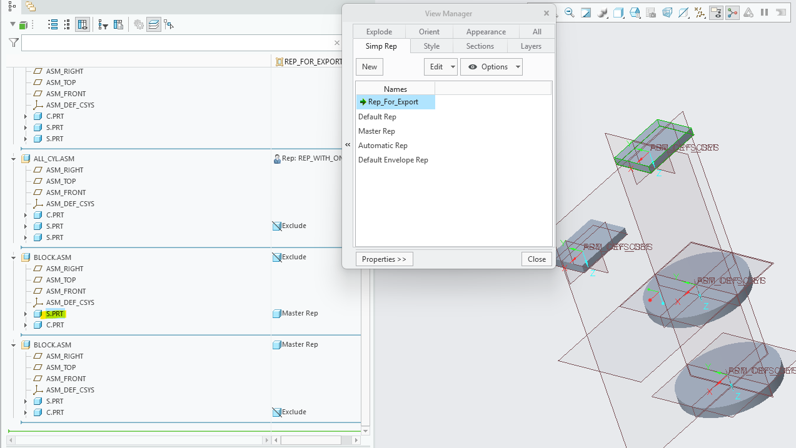
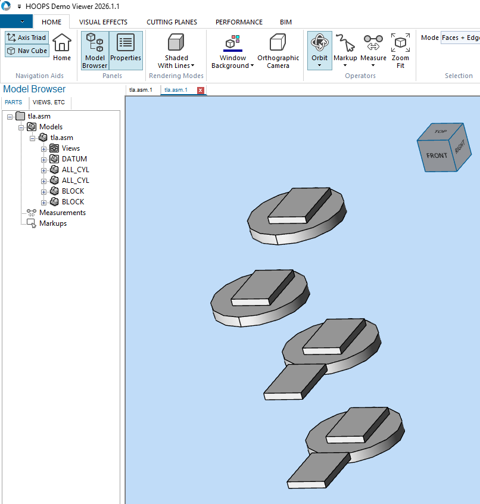
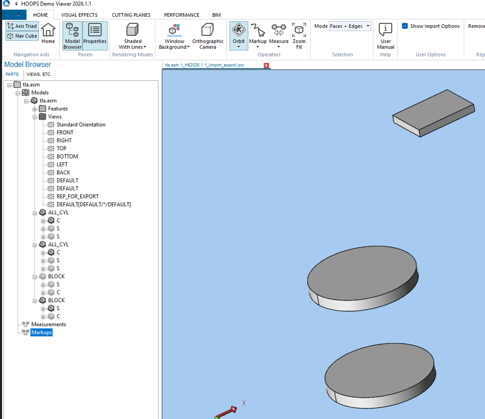

# usd-convert-cad Limitations

This file records known limitations for the `usd-convert-cad` package and the `omniverse-cad-to-usd` agent skill that drives it.

## Platform Support

- AutoCAD (`.dwg`, `.dxf`) and Revit (`.rvt`, `.rfa`) conversion is **not supported on `linux-aarch64`**. The HOOPS Exchange DWG/Revit readers are not available for that architecture, so these conversions fail with `A3D_LOAD_INVALID_FILE_FORMAT` (error code `-10005`) and produce no output.
- These formats are supported on `windows-x86_64` and `linux-x86_64`. All other listed formats are supported on all three platforms.
- Do not attempt DWG/DXF or RVT/RFA conversion on `linux-aarch64`; treat those inputs as unsupported on that platform.

## File Size

- Loading Revit source CAD files that are 2 GB or larger can fail due to a HOOPS Exchange SDK limitation.

## Revit Families

- Nested Revit families can be flattened during conversion and merge into one component in the resulting USD hierarchy.

## Revit Pipe Catalog Elements

### Insufficient Tessellation Quality on Native Revit Pipe Catalog Elements

- When converting Revit models containing pipe catalog elements (pipes, elbows, couplings, tees, etc.), curved surfaces may appear faceted rather than smooth due to insufficient tessellation resolution.
- This results in visual artifacts and faceted shading on cylindrical and curved pipe components in the converted USD output.

Workaround: Scene Optimizer Utilities

To improve the visual quality of affected pipe elements:

1. Disable the "instanceable" flag on meshes that require the workaround.
2. Run Scene Optimizer Mesh Cleanup with all settings enabled.
3. Run Scene Optimizer Generate Normals with default settings.

**Note:** The instanceable flag must be disabled before applying Scene Optimizer operations for the changes to take effect.

## Creo Simplified Representations

### Creo Simplified Representation May Exclude Child Parts When Parent Assembly Is Excluded

- When converting Creo (Pro/E) files using the **View Layer Name** option to extract a simplified representation, child parts may be incorrectly excluded from the converted USD output even when they are specified to load as a different representation.
- This is a limitation in the HOOPS Exchange SDK. Support for Creo Simplified Representations was introduced in HOOPS Exchange 2026.1.0 and improvements are being worked on by TechSoft.

Default Simplified Representation in Creo

Custom Simplified Representation in Creo

Default Simplified Representation Converted in HOOPS Demo Viewer 2026.1.1

Custom Simplified Representation Converted in HOOPS Demo Viewer 2026.1.1

## Format Interpretation

- `.prt` and `.asm` file interpretation depends on source content because multiple CAD systems use those extensions.

## Runtime Requirements

- This wheel supports one converter core and does not expose converter selection.
- Installation requires network access to the Python package index hosting the wheel.

## References

- [HOOPS Core converter known issues](https://docs.omniverse.nvidia.com/kit/docs/omni.kit.converter.hoops_core/latest/Known_Issues.html#known-issues)
